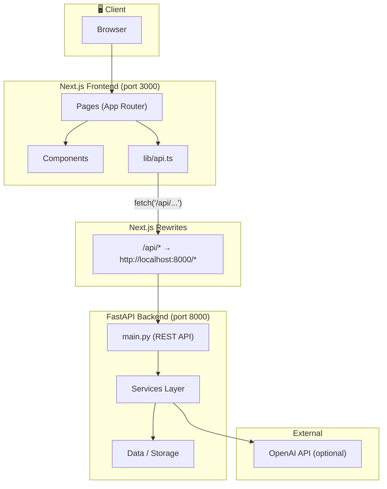
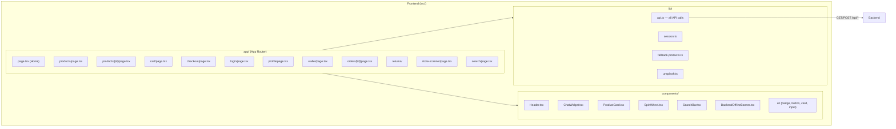
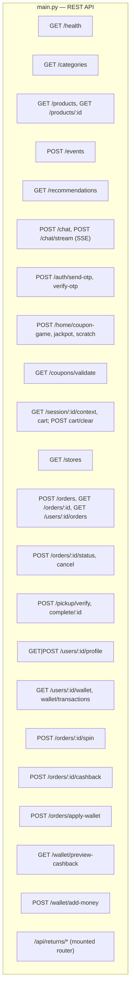
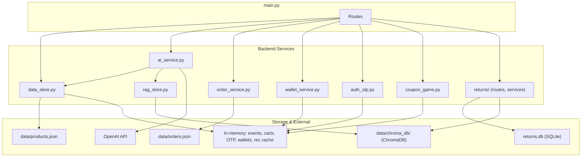
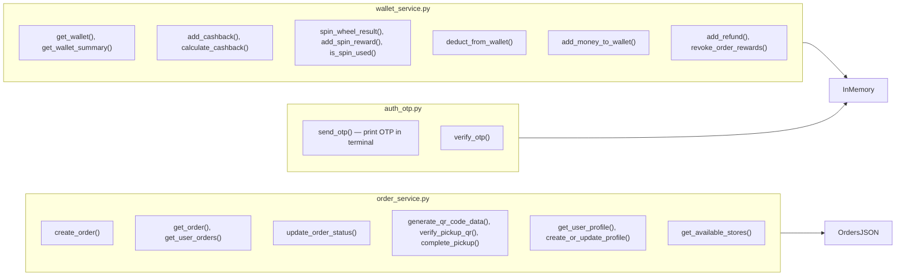
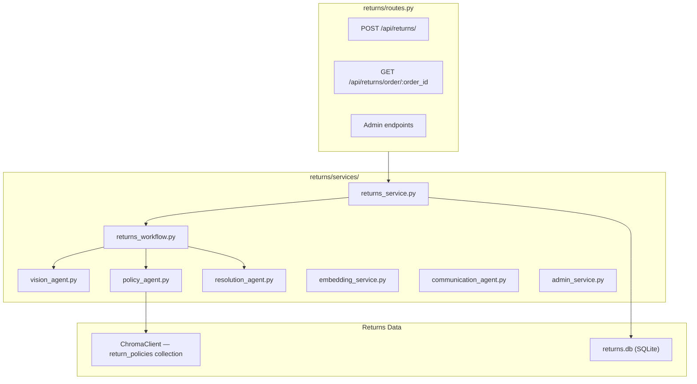

# AuraShop — Low-Level Architecture Diagram

This document describes the **low-level architecture** of AuraShop: components, data flow, and storage.

---

## 1. System Overview (High-Level)

---

## 2. Frontend (Next.js) — Low-Level

**Key:** All backend calls go through `lib/api.ts` using base path `/api`. Next.js `rewrites` in `next.config.js` send `/api/:path*` to `http://localhost:8000/:path*`.

---

## 3. Backend API (FastAPI) — Routes & Handlers

---

## 4. Backend Services & Data Flow

---

## 5. Data Store & AI Layer (Detail)

```mermaid
flowchart TB
    subgraph data_store["data_store.py"]
        LoadProducts["load_products()"]
        GetProduct["get_product(), get_products(), get_categories()"]
        Events["add_event(), get_events()"]
        Cart["get_cart(), add_to_cart(), remove_from_cart(), clear_cart()"]
        Context["get_session_context()"]
        RecCache["get_cached_recommendations(), cache_recommendations()"]
    end

    subgraph ai_service["ai_service.py"]
        Intent["_classify_intent() → order | recommend | faq | general"]
        AgentIntent["_parse_agent_intent() (OpenAI)"]
        GetRecs["get_recommendations()"]
        Chat["chat(), chat_stream()"]
    end

    subgraph rag_store["rag_store.py"]
        ChromaClient["ChromaDB PersistentClient"]
        ProductsCollection["products collection (embeddings)"]
        FAQCollection["FAQ collection (embeddings)"]
        SearchProducts["search_products()"]
        SearchFAQ["search_faq()"]
    end

    GetRecs --> Context
    GetRecs --> RAGStore
    GetRecs --> RecCache
    Chat --> Intent
    Chat --> AgentIntent
    Chat --> RAGStore
    Chat --> DataStore
    RAGStore --> ChromaClient
```

---

## 6. Orders, Wallet & Auth (Detail)

---

## 7. Returns Module (Detail)

---

## 8. Storage Summary

| Storage | Type | Used By | Purpose |
|--------|------|---------|---------|
| `backend/data/products.json` | JSON file | data_store | Product catalog (loaded at startup) |
| `backend/data/orders.json` | JSON file | order_service | Orders + user profiles (persisted) |
| `backend/data/chroma_db/` | ChromaDB (persistent) | rag_store, returns | Product/FAQ embeddings; return policies |
| `backend/returns.db` | SQLite | returns module | Return requests, order snapshot, status |
| In-memory dicts | Python dicts | data_store, auth_otp, wallet_service, coupon_game | Events, carts, OTP, wallets, spin state, rec cache |

---

## 9. Request Flow Examples

**Product listing:**  
Browser → Next.js (products page) → `api.ts` `fetchProducts()` → `GET /api/products` → Next rewrite → FastAPI `GET /products` → `data_store.get_products()` → `products.json` + in-memory → JSON response.

**Chat (streaming):**  
Browser → ChatWidget → `api.ts` `chatStream()` → `POST /api/chat/stream` → FastAPI → `ai_service.chat_stream()` → intent + RAG/OpenAI → SSE chunks → client `onChunk` / `onDone`.

**Place order:**  
Checkout page → `POST /api/orders` (body: user_id, items, delivery_method, address/store) → `order_service.create_order()` → write to `orders.json` → return order with QR if store pickup.

**Login:**  
Login page → `sendOtp(email)` → `POST /api/auth/send-otp` → `auth_otp.send_otp()` (store OTP in memory, print in terminal) → `verifyOtp(email, otp)` → `POST /api/auth/verify-otp` → return `{ email, name }`; frontend stores user in session.

---

You can render these Mermaid diagrams in GitHub, VS Code (with a Mermaid extension), or [mermaid.live](https://mermaid.live).
