# AuraShop — Low-Level Architecture Diagram

This document describes the **low-level architecture** of AuraShop: components, data flow, and storage.

---

## 1. System Overview (High-Level)

```mermaid
flowchart TB
    subgraph Client["🖥️ Client"]
        Browser["Browser"]
    end

    subgraph Frontend["Next.js Frontend (port 3000)"]
        Pages["Pages (App Router)"]
        Components["Components"]
        API_Client["lib/api.ts"]
    end

    subgraph Proxy["Next.js Rewrites"]
        Rewrite["/api/* → http://localhost:8000/*"]
    end

    subgraph Backend["FastAPI Backend (port 8000)"]
        Main["main.py (REST API)"]
        Services["Services Layer"]
        Data["Data / Storage"]
    end

    subgraph External["External"]
        OpenAI["OpenAI API (optional)"]
    end

    Browser --> Pages
    Pages --> Components
    Pages --> API_Client
    API_Client -->|"fetch('/api/...')"| Rewrite
    Rewrite --> Main
    Main --> Services
    Services --> Data
    Services --> OpenAI
```

---

## 2. Frontend (Next.js) — Low-Level

```mermaid
flowchart LR
    subgraph Frontend["Frontend (src/)"]
        subgraph App["app/ (App Router)"]
            Home["page.tsx (Home)"]
            Products["products/page.tsx"]
            ProductDetail["products/[id]/page.tsx"]
            Cart["cart/page.tsx"]
            Checkout["checkout/page.tsx"]
            Login["login/page.tsx"]
            Profile["profile/page.tsx"]
            Wallet["wallet/page.tsx"]
            Orders["orders/[id]/page.tsx"]
            Returns["returns/"]
            StoreScanner["store-scanner/page.tsx"]
            Search["search/page.tsx"]
        end

        subgraph Components["components/"]
            Header["Header.tsx"]
            ChatWidget["ChatWidget.tsx"]
            ProductCard["ProductCard.tsx"]
            SpinWheel["SpinWheel.tsx"]
            SearchBar["SearchBar.tsx"]
            BackendOffline["BackendOfflineBanner.tsx"]
            UI["ui/ (badge, button, card, input)"]
        end

        subgraph Lib["lib/"]
            API["api.ts — all API calls"]
            Session["session.ts"]
            Fallback["fallback-products.ts"]
            Unsplash["unsplash.ts"]
        end
    end

    App --> Components
    App --> Lib
    API -->|"GET/POST /api/*"| Backend
```

**Key:** All backend calls go through `lib/api.ts` using base path `/api`. Next.js `rewrites` in `next.config.js` send `/api/:path*` to `http://localhost:8000/:path*`.

---

## 3. Backend API (FastAPI) — Routes & Handlers

---

## 4. Backend Services & Data Flow

---

## 5. Data Store & AI Layer (Detail)

---

## 6. Orders, Wallet & Auth (Detail)

---

## 7. Returns Module (Detail)

---

## 8. Storage Summary

| Storage | Type | Used By | Purpose |
|--------|------|---------|---------|
| `backend/data/products.json` | JSON file | data_store | Product catalog (loaded at startup) |
| `backend/data/orders.json` | JSON file | order_service | Orders + user profiles (persisted) |
| `backend/data/chroma_db/` | ChromaDB (persistent) | rag_store, returns | Product/FAQ embeddings; return policies |
| `backend/returns.db` | SQLite | returns module | Return requests, order snapshot, status |
| In-memory dicts | Python dicts | data_store, auth_otp, wallet_service, coupon_game | Events, carts, OTP, wallets, spin state, rec cache |

---

## 9. Request Flow Examples

**Product listing:**  
Browser → Next.js (products page) → `api.ts` `fetchProducts()` → `GET /api/products` → Next rewrite → FastAPI `GET /products` → `data_store.get_products()` → `products.json` + in-memory → JSON response.

**Chat (streaming):**  
Browser → ChatWidget → `api.ts` `chatStream()` → `POST /api/chat/stream` → FastAPI → `ai_service.chat_stream()` → intent + RAG/OpenAI → SSE chunks → client `onChunk` / `onDone`.

**Place order:**  
Checkout page → `POST /api/orders` (body: user_id, items, delivery_method, address/store) → `order_service.create_order()` → write to `orders.json` → return order with QR if store pickup.

**Login:**  
Login page → `sendOtp(email)` → `POST /api/auth/send-otp` → `auth_otp.send_otp()` (store OTP in memory, print in terminal) → `verifyOtp(email, otp)` → `POST /api/auth/verify-otp` → return `{ email, name }`; frontend stores user in session.

---

You can render these Mermaid diagrams in GitHub, VS Code (with a Mermaid extension), or [mermaid.live](https://mermaid.live).
