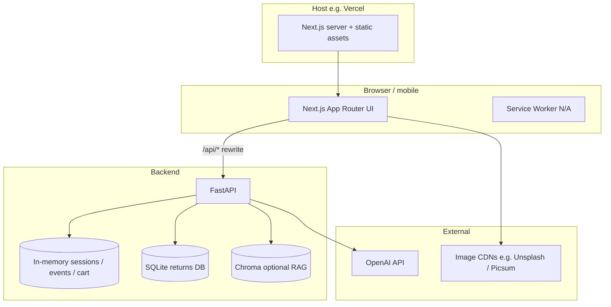
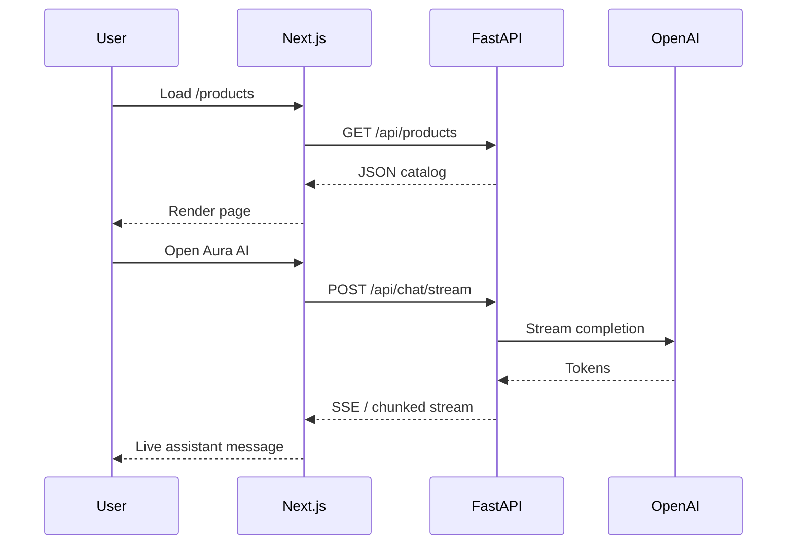
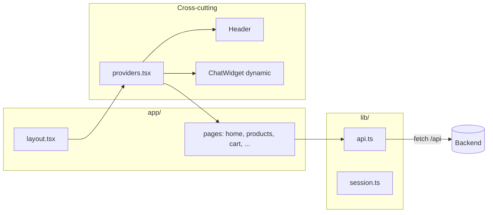
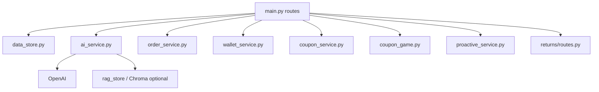

<div align="center">

# AuraShop

### AI-Powered Personalized Shopping Assistant

**Full-stack e-commerce prototype** with real-time recommendations, streaming AI chat, wallet & rewards, store pickup with QR, returns pipeline, and an **Aura-branded** glassmorphism UI.

[](https://nextjs.org/)
[](https://fastapi.tiangolo.com/)
[](https://www.python.org/)
[](https://tailwindcss.com/)

[Features](#-feature-overview) · [Architecture](#-architecture) · [Setup](#-quick-start) · [API](#-api-reference) · [Deploy](#-deployment)

</div>

---

## Table of contents

1. [Overview](#overview)
2. [Feature overview](#-feature-overview)
3. [Features and functionality (detailed)](#-features-and-functionality-detailed)
4. [Architecture](#-architecture)
5. [Tech stack](#-tech-stack)
6. [Repository layout](#-repository-layout)
7. [Quick start](#-quick-start)
8. [Environment variables](#-environment-variables)
9. [API reference](#-api-reference)
10. [Frontend highlights](#-frontend-highlights)
11. [Performance](#-performance--production-notes)
12. [Testing](#-testing)
13. [Troubleshooting](#-troubleshooting)
14. [Additional documentation](#-additional-documentation)
15. [License](#license)

---

## Overview

AuraShop demonstrates an **omnichannel retail experience**: browse a catalog with AI-ranked picks, talk to **Aura AI** (streaming replies + product cards), manage a session cart, checkout with **home delivery or store pickup**, track orders with **QR codes**, use **AuraPoints / wallet**, play **discount mini-games**, and file **returns** backed by an optional AI-assisted workflow.

The **Next.js** app proxies `/api/*` to a **FastAPI** backend (`API_URL`, default `http://localhost:8000`). If the API is down, the UI degrades gracefully with **fallback catalog data** and a **backend offline** banner.

---

## Feature overview

| Area | What you get |
|------|----------------|
| **Catalog & search** | Category filters, price/rating filters, dedicated search page, grocery vs general **store mode** |
| **Home experience** | Hero carousel, quick category chips, “Picked for you”, shop-by-category grid, offers strip, games entry |
| **AI recommendations** | Session + behavior signals, OpenAI-powered ranking with rule-based fallback, “Top picks” on listing |
| **Aura AI chat** | Streaming responses, proactive hints, inline product cards, suggested prompts, cart/checkout awareness |
| **Cart & checkout** | Coupons (validate against `/coupons`), spin/scratch games, order summary, delivery vs **store pickup**, AuraPoints |
| **Orders** | Status lifecycle, QR for pickup, post-order spin / cashback hooks |
| **Wallet** | Balance, transactions, cashback preview, top-up placeholder |
| **Profile & auth** | Local profile demo; OTP endpoints for auth flows |
| **Discounts** | Discounts listing, coupon validation, games (spin, jackpot, scratch) |
| **Returns** | Create return, tracking; SQLAlchemy module with vision/policy agents (when deps available) |
| **Store staff** | `/store-scanner` flow to verify QR and complete pickup |
| **UX / brand** | Aura palette (dark red, logo red, orange), glass headers, responsive layout, safe-area aware chrome |
| **Shopping vibe** | Optional ambient “shopping music” modes (Chill / Energetic / Calm) |

---

## Features and functionality (detailed)

This section describes what the app actually does end-to-end: user-visible flows, how the frontend and backend cooperate, and where behavior is optional or demo-oriented.

### Catalog, search, and store modes

- **Product catalog** is served from JSON on the API (`products.json` or imported datasets). The listing supports **category filters**, **price and rating filters**, and sorting appropriate to the page. Product detail pages show availability hooks and integrate with recommendations and chat context.
- **Dedicated search** (`/search`) lets shoppers query the catalog with the same quality-of-life patterns as the main listing (filters, responsive layout).
- **Store mode** (groceries vs general retail) is a first-class concept in the UI: the header and accent treatments **switch** (for example, grocery mode uses a green gradient chrome instead of the default Aura red gradient). Mode is carried in client context so browsing feels like two storefront personalities without separate deployments.

### Home experience

- The **home page** combines marketing-style content with commerce: a **hero carousel**, **quick category chips**, a **“Picked for you”** strip driven by recommendations, a **shop-by-category** grid, an **offers / promotions** area, and **entry points to discount games**. The layout is tuned for demos: dense but readable, with glass-style cards consistent with the rest of the app.

### Personalized recommendations

- The backend **tracks lightweight behavior** (views, cart adds, session context) and combines that with **OpenAI-assisted ranking** when a key is configured. If the model or network is unavailable, **rule-based fallbacks** still return sensible “Top picks” so the UI never looks empty.
- Recommendations surface on listing pages and home, reinforcing the “AI store” story without requiring shoppers to open the chat.

### Aura AI chat (streaming assistant)

- **Aura AI** is a floating assistant available on every page (loaded with **dynamic import** to keep the first bundle smaller). It supports **streaming completions**: tokens arrive incrementally so responses feel live.
- The assistant can show **inline product cards** when the model suggests items, **suggested prompts** to reduce blank-page friction, and **proactive hints** fetched from `/chat/proactive` so the widget can nudge based on session context.
- Chat is aware of **cart and checkout concepts** at the API level (`session` context), so answers can reference what the shopper is doing (demo-grade wiring; extend for production policies).
- **`USE_BUILTIN_CHAT`** on the backend forces a built-in responder without OpenAI—useful for CI, air-gapped demos, or when you do not want external calls.

### Cart, checkout, coupons, and AuraPoints

- **Cart** is **session-backed** on the API: the frontend sends a stable session id (see `session` helpers) and syncs line items through REST endpoints. The header badge reflects cart count and refreshes after mutations.
- **Checkout** (`/checkout`) supports **home delivery** vs **store pickup**. For pickup, the shopper picks from **live store list** (`/stores`), including maintenance flags. Address and contact fields are collected for delivery; pickup flows emphasize store selection.
- **Coupons** can be validated against `/coupons/validate`; the cart can pass a pre-applied coupon into checkout via **sessionStorage** so the journey feels connected.
- **AuraPoints / wallet**: shoppers can **preview cashback**, see **wallet balance**, and **apply points** up to the payable amount (capped by balance and order total after coupon). Top-up is exposed as a **demo placeholder** endpoint for UX completeness.

### Orders, pickup QR, and store scanner

- **Order creation** persists orders server-side with status lifecycle, user linkage (email/session-based ids in the demo), and metadata for fulfillment type.
- **Store pickup** generates **QR-oriented data** so the order detail page can show scannable content for staff verification; the **store scanner** page (`/store-scanner`) lets staff **verify** and **complete** pickup through dedicated API routes.
- **Post-order engagement**: spin / cashback style hooks exist to mirror loyalty programs (see wallet and order spin endpoints).

### Wallet and transactions

- The **wallet** page summarizes **balance**, **recent transactions**, and **cashback mechanics** where implemented. Backend services handle **accrual**, **deduction at checkout**, **refund-like adjustments**, and **spin rewards** as separate concerns so you can evolve loyalty rules without rewriting checkout.

### Discounts and mini-games

- A **discounts** area lists promotional content; games (**spin**, **jackpot**, **scratch**) hit dedicated endpoints and integrate with **coupon / reward** storytelling on home and checkout. These are ideal for engagement demos; wire real eligibility rules before production.

### Returns and exchanges

- A **returns** submodule (FastAPI routes under `/returns/*`) supports **creating** and **tracking** returns. When optional ML / agent dependencies are installed, **vision and policy-style agents** can participate in resolution workflows (SQLite persistence). If imports fail, the API may **degrade** and omit those routes—check startup logs.

### Profile and authentication

- **Profile** is demo-oriented: create/update profile data through the API with a simple client experience.
- **OTP send/verify** endpoints exist for **auth flows**; the UI may use local profile state (`localStorage`) for quick demos while still showing how a real integration would map to backend auth.

### Referral / invite

- **`/invite/[code]`** demonstrates referral-style landing: shareable paths for campaigns or partner codes (implementation details live in the page and API usage there).

### Shopping vibe (ambient audio)

- An optional **shopping vibe** control (Chill / Energetic / Calm) layers **ambient audio** on the experience. It is **non-blocking** and respects a playful retail mood without affecting cart or checkout correctness.

### Design system and UX

- **Aura brand gradient** (`aura-gradient` in Tailwind) is used for heroes, key CTAs, and thin accent bars—**not** for dense text blocks. **Glass** utilities (`aura-header-glass`, `aura-nav-glass`, `glass-card`) give frosted surfaces; **grocery mode** swaps header styling to a **green** treatment.
- **Typography** uses **Manrope** via `next/font`. **Safe-area** padding on the main shell improves notched phones. **Dark mode** variables are defined for future toggles even where the UI is primarily light.

### Resilience when the API is down

- If FastAPI is unreachable, the UI shows a **backend offline** banner and, where implemented, **falls back to static catalog data** so demos still run. This is intentional for hackathons and reviews—production should surface clear errors and retry policies instead.

---

## Architecture

### System context

High-level view of how the browser, Next.js app, API, and external services relate.



### Request path (example: product + recommendations)



### Frontend module map



### Backend service map (conceptual)



---

## Tech stack

| Layer | Technologies |
|--------|----------------|
| **Frontend** | Next.js 14 (App Router), React 18, TypeScript, Tailwind CSS 3, Radix UI primitives, Framer Motion, Lucide icons, `next/font` (Manrope) |
| **Backend** | Python, FastAPI, Pydantic v2, Uvicorn |
| **AI** | OpenAI API (`gpt-4o-mini` style flows in `ai_service.py`), optional RAG with Chroma + sentence-transformers |
| **Returns module** | SQLAlchemy, SQLite, LangGraph / LangChain (optional agent pipeline) |
| **Data** | JSON product catalog, in-memory sessions/events; optional Kaggle import scripts |
| **E2E** | Playwright (`frontend/e2e/`) |

---

## Repository layout

```
AuraShop/
├── backend/
│   ├── app/
│   │   ├── main.py              # FastAPI app, routes, CORS, lifespan
│   │   ├── config.py            # OPENAI_API_KEY, CORS_ORIGINS, USE_BUILTIN_CHAT
│   │   ├── models.py            # Pydantic request/response models
│   │   ├── data_store.py        # Products, sessions, cart, events
│   │   ├── ai_service.py        # Recommendations + chat (+ stream)
│   │   ├── order_service.py     # Orders, stores, pickup QR, profile helpers
│   │   ├── wallet_service.py    # AuraPoints, cashback, transactions
│   │   ├── coupon_service.py    # Coupon validation
│   │   ├── coupon_game.py       # Spin / jackpot / scratch
│   │   ├── proactive_service.py # Proactive chat hints
│   │   ├── analytics_service.py
│   │   ├── behavior_signals.py / price_signals.py / user_preferences.py
│   │   ├── auth_otp.py
│   │   ├── returns/             # Return & exchange submodule
│   │   │   ├── routes.py
│   │   │   ├── db.py / db_models.py
│   │   │   └── services/        # Vision, policy, resolution agents, workflow
│   │   └── ...
│   ├── data/                    # products.json, orders, etc. (as used by app)
│   ├── scripts/                 # Seed, Kaggle, image fixes
│   └── requirements.txt
├── frontend/
│   ├── src/
│   │   ├── app/                 # App Router pages + layout + providers
│   │   ├── components/          # Header, ChatWidget, ProductCard, home, UI kit
│   │   ├── context/             # Store mode, shopping vibe
│   │   ├── hooks/
│   │   ├── lib/                 # api.ts, session, unsplash, wishlist, ...
│   │   └── services/            # productService (client catalog helpers)
│   ├── next.config.js           # rewrites to API_URL, image remotePatterns, optimizePackageImports
│   ├── tailwind.config.ts
│   └── e2e/
├── README.md                    # This file
├── README_KAGGLE_INTEGRATION.md
├── VERCEL_DEPLOYMENT.md         # If present: deploy notes
└── ENHANCEMENTS.md / NEW_FEATURES.md / ...  # Legacy deep-dives
```

---

## Quick start

### Prerequisites

- **Node.js 18+** and npm  
- **Python 3.11+**  
- **OpenAI API key** (recommended for full AI; optional fallback modes exist)

### 1. Backend (run first)

```bash
cd backend
python -m venv .venv

# Windows
.venv\Scripts\activate
# macOS / Linux
# source .venv/bin/activate

pip install -r requirements.txt
copy .env.example .env   # Windows
# cp .env.example .env   # macOS/Linux
# Edit .env: OPENAI_API_KEY=sk-...
```

```bash
uvicorn app.main:app --reload --host 0.0.0.0 --port 8000
```

- **API:** `http://localhost:8000`  
- **OpenAPI docs:** `http://localhost:8000/docs`

### 2. Frontend

```bash
cd frontend
npm install
npm run dev
```

- **App:** `http://localhost:3000`  
- Browser calls **`/api/...`**; Next.js **rewrites** to `API_URL` (see `next.config.js`).

### 3. Production build (frontend)

```bash
cd frontend
npm run build
npm start
```

---

## Environment variables

### Backend (`backend/.env`)

| Variable | Purpose |
|----------|---------|
| `OPENAI_API_KEY` | OpenAI key for recommendations + chat |
| `USE_BUILTIN_CHAT` | Set `1` / `true` to force built-in chat (no OpenAI) |
| `CORS_ORIGINS` | Comma-separated origins (default `http://localhost:3000`) |

### Frontend (optional)

| Variable | Purpose |
|----------|---------|
| `API_URL` | Used by **Next.js rewrites** in `next.config.js` (default `http://localhost:8000`) |

Set `API_URL` in production to your deployed API origin.

---

## API reference

Base URL is the backend host; the frontend uses the **same origin** with path `/api` rewritten.

| Method | Path | Description |
|--------|------|-------------|
| GET | `/health` | Health check |
| GET | `/categories` | Product categories |
| GET | `/products` | List products (filters: category, price, rating, color, limit) |
| GET | `/products/{id}` | Product detail |
| GET | `/products/{id}/availability` | Store / online availability |
| POST | `/events` | Analytics & cart sync events |
| GET | `/recommendations` | AI recommendations |
| GET | `/chat/proactive` | Proactive hints for chat |
| POST | `/chat` | AI chat (JSON) |
| POST | `/chat/stream` | Streaming AI chat |
| POST | `/auth/send-otp` | OTP send |
| POST | `/auth/verify-otp` | OTP verify |
| POST | `/home/coupon-game` | Spin-style coupon game |
| POST | `/home/jackpot` | Jackpot game |
| POST | `/home/scratch` | Scratch game |
| GET | `/coupons/validate` | Validate coupon for checkout |
| GET | `/session/{id}/context` | Session context for AI |
| GET | `/session/{id}/cart` | Get cart |
| POST | `/session/{id}/cart/clear` | Clear cart |
| GET | `/discounts` | Discounts / coupons listing |
| GET | `/stores` | Pickup stores |
| POST | `/orders` | Place order |
| GET | `/orders/{id}` | Order detail + QR data |
| GET | `/users/{id}/orders` | User orders |
| POST | `/orders/{id}/status` | Update status (admin/demo) |
| POST | `/orders/{id}/cancel` | Cancel order |
| POST | `/pickup/verify` | Verify pickup QR |
| POST | `/pickup/complete/{id}` | Complete pickup |
| GET/POST | `/users/{id}/profile` | Profile |
| GET | `/users/{id}/wallet` | Wallet summary |
| GET | `/users/{id}/wallet/transactions` | Transactions |
| POST | `/orders/{id}/spin` | Post-order spin |
| POST | `/orders/{id}/cashback` | Cashback credit |
| POST | `/orders/apply-wallet` | Apply AuraPoints to order |
| GET | `/wallet/preview-cashback` | Cashback preview |
| POST | `/wallet/add-money` | Wallet top-up (demo) |
| * | `/returns/*` | Return & exchange APIs (see `returns/routes.py`) |

> Full schemas: Open **`/docs`** on the running API.

---

## Frontend highlights

| Topic | Details |
|--------|---------|
| **Routing** | App Router: `/`, `/products`, `/products/[id]`, `/search`, `/cart`, `/checkout`, `/discounts`, `/wallet`, `/profile`, `/login`, `/orders/[id]`, `/returns/*`, `/store-scanner`, `/invite/[code]`, … |
| **State** | React context: auth + cart session, store mode (groceries vs general), shopping vibe audio |
| **API client** | `src/lib/api.ts` — fetch helpers with offline fallbacks where implemented |
| **Design system** | CSS variables in `globals.css` (light/dark), Tailwind `brand.*`, glass utilities (`.aura-header-glass`, `.glass-card`) |
| **Chat** | `ChatWidget` loaded dynamically in production builds to reduce initial JS |
| **Images** | Remote patterns for Unsplash / Picsum in `next.config.js`; many components use optimized `` patterns (see ESLint hints for gradual `next/image` migration) |

---

## Performance & production notes

- **Code splitting:** Aura AI chat bundle and home view are loaded with `next/dynamic` where configured; `optimizePackageImports` trims **lucide-react** and **framer-motion** imports.
- **Cart fetch** may be deferred slightly after first paint (`requestIdleCallback`) so hydration stays responsive.
- **Slow TTFB or `/api` latency** usually indicates **backend region, cold starts, or DB** — profile the API independently of the UI.
- **Vercel:** Set project **Root Directory** to `frontend` if the repo root is not the Next app (see existing deploy doc).

---

## Testing

```bash
cd frontend
npm run test:e2e
```

Uses Playwright (`playwright.config.ts`, `e2e/full-app.spec.ts`). Install browsers if prompted (`npx playwright install`).

---

## Troubleshooting

### `ECONNRESET` / failed proxy to `localhost:8000`

The backend is not running or refused the connection. Start:

```bash
cd backend
.venv\Scripts\activate   # Windows
uvicorn app.main:app --reload --host 0.0.0.0 --port 8000
```

### Backend banner: “Backend not running”

Same as above; the UI still loads with **fallback data** when possible.

### Returns module failed to load

Check console on API startup. The app catches import errors and may run without the returns router; verify SQLAlchemy / optional ML deps per `requirements.txt`.

### Image 503 / broken URLs

Transient CDN issues; refresh. For production, prefer stable image hosts and `next/image` where applicable.

---

## Additional documentation

| File | Content |
|------|---------|
| `README_KAGGLE_INTEGRATION.md` | Kaggle dataset integration |
| `VERCEL_DEPLOYMENT.md` | Vercel / full-stack deploy notes (if present) |
| `ENHANCEMENTS.md`, `NEW_FEATURES.md`, `STORE_PICKUP_GUIDE.md`, `DEMO_GUIDE.md` | Legacy deep-dives referenced in older README sections |

---

## License

MIT

---

<div align="center">

**Built for demos, hackathons, and extension into production-grade commerce.**

</div>
